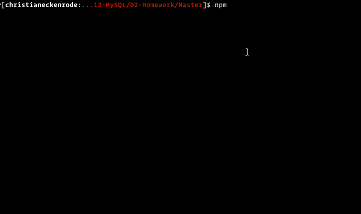

# MySQL Homework: Employee Tracker

Developers are often tasked with creating interfaces that make it easy for non-developers to view and interact with information stored in databases. Often these interfaces are known as **C**ontent **M**anagement **S**ystems. In this  assignment, I built a solution for managing a company's employees using node, inquirer, and MySQL.


The application will be invoked by using the following command:

```bash
node app.js

```

* A walkthrough video that demonstrates the functionality of the Employee Tracker:
[Walkthrough video using Screencastify](https://drive.google.com/file/d/1g1wnG1ixBs2MRBVpolBdD_nh3bfTxGQ0/view)




